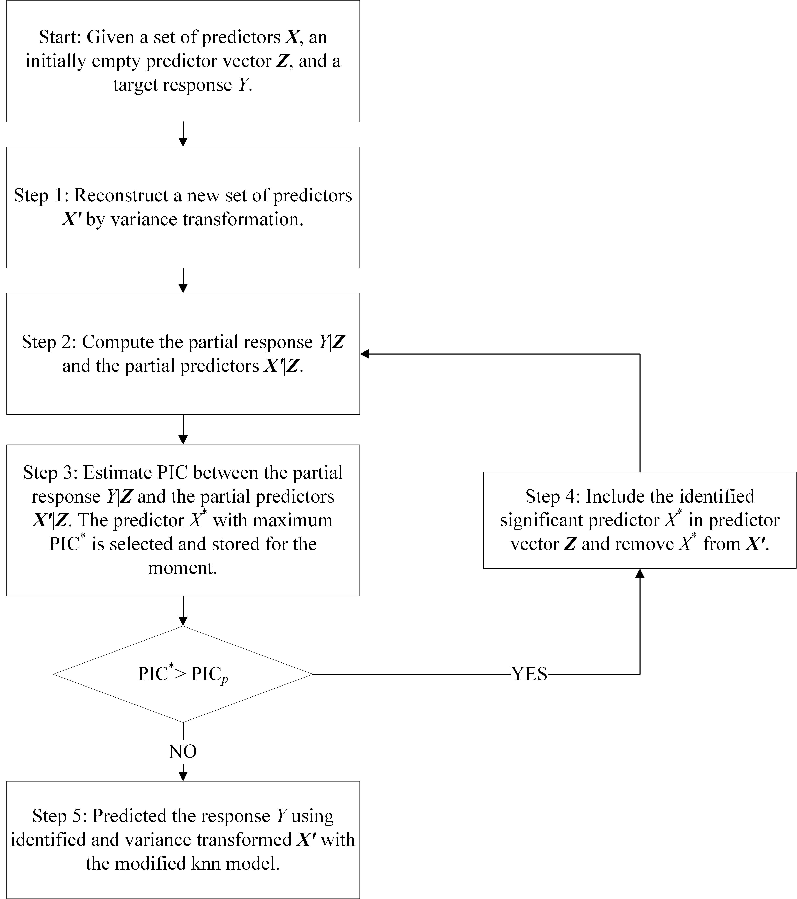

```{r setup, include = FALSE}
wf="haar"; mode="MODWT"; k.folds=4

knitr::opts_chunk$set(
            collapse = TRUE,
            comment = "#>",     
						echo = TRUE, 
						message = FALSE, 
						warning = FALSE, 
						cache = FALSE, 
						
						root.dir = "./",
						
						fig.align='center', 
						fig.pos="H",
						fig.path = paste0("figure/EMS2020-",wf,"-"), 
						cache.path = paste0("cache/EMS2020-",wf,"-"),
						dev = "jpeg", 
						dpi=500)

library(rmarkdown)
library(knitr)
library(kableExtra)
library(bookdown)
library(formatR)
#library(tinytex) # to generate PDF output if you never use Latex before
#tinytex::install_tinytex()  # install TinyTeX
```

# Introduction
This reproducible and dynamic report was created using Bookdown (based on Rmarkdown and Knit) package, and summarizes the basic code and outputs (plots, tables, etc) produced during the course. The relative file paths indicated in the code below assume that your project working directly is structured as indicated here. If Knit PDF is problematic for you, switch the output to html. 

The code below shows how the figures in the manuscript is reproduced. 

# Reproducibility and accessibility
In order to reproduce all steps listed below, the first thing is to install WASP package from https://github.com/zejiang-unsw/WASP (following the instruction and install all the dependencies). The data, demo and all code used in this analysis, including the Rmarkdown document used to compile this supplementary code file, are all available on GitHub. Once this GitHub repo has been downloaded, navigate to /WASP/vignettes to find the Rmarkdown document, and set this as your working directory for executing code.  

# Required R packages
A variety of R packages was used for this analysis. All graphics and data wrangling were handled using the tidyverse suite of packages. All packages used are available from the Comprehensive R Archive Network (CRAN) or Github.


```{r packages, include=TRUE}
#devtools::install_github("zejiang-unsw/WASP", dependencies = TRUE)
#devtools::install_github("zejiang-unsw/NPRED")

library(WASP)
library(NPRED)
library(cowplot)
library(ggplot2)
library(raster)
library(parallel) #parallel computing
library(overlapping) #PDF skill scores
library(tidyverse)

# source("./code/EMS2020_Figure3-5.R") # if you want to knit with new results
# source("./code/EMS2020_Figure4.R") # if you want to knit with new results
Grid.sample = c(94,142,177,149)
```

# Figure 1: Flowchart of the proposed method

```{r fig1, fig.show='asis', fig.cap='Flowchart of the proposed method', fig.height=5, fig.width=5, out.width= '50%'}

```

# Figure 2: A demo of WASP package

Figure \@ref(fig:fig2) is a screenshot of the sequence of R commands illustrating the usage of the WASP package to transform the potential predictors (see Fig. \@ref(fig:figS1) in the Supporting Material for an example of predictor variables before and after variance transformation corresponding to the response), identify the significant predictors and predict the associated response. MODWT is adopted as the basis of wavelet transform in this case study since we are using observed data to predict target response and thus there is no dependence on future information. 

Not that this will be empty figure in output directory since the figure is the code chunk itself. 

```{r fig2, fig.cap='A demo of WASP package', out.width= '0%'}
#-------------------------------------------------------------------------------------
#load response and predictor variables
data(SPI.12); data(data.CI); data(Ind_AWAP.2.5)
#study grids and period
Grid = sample(Ind_AWAP.2.5,1)
Grid = 149 # A sample grid
SPI.12.ts <- window(SPI.12, start=c(1910,1),end=c(2009,12))
data.CI.ts <- window(data.CI, start=c(1910,1),end=c(2009,12))
#partition into two folds
folds <- cut(seq(1,nrow(SPI.12.ts)),breaks=2,labels=FALSE)
sub.cali <- which(folds==1, arr.ind=TRUE); sub.vali <- which(folds==2, arr.ind=TRUE)
#-------------------------------------------------------------------------------------
###calibration and selection
data <- list(x=SPI.12.ts[sub.cali,Grid],dp=data.CI.ts[sub.cali,])

#variance transformation - calibration
dwt <- modwt.vt(data, wf=wf, J=8, boundary="periodic")

#stepwise PIC selection
sel <- NPRED::stepwise.PIC(dwt$x, dwt$dp.n)
#-------------------------------------------------------------------------------------
###validation and prediction
data.val <- list(x=SPI.12.ts[sub.vali,Grid],dp=data.CI.ts[sub.vali,])

#variance transformation - validation
dwt.val <- modwt.vt.val(data.val, J=8, dwt)

#knn prediction
cpy <- sel$cpy; wt <- sel$wt
x=data$x; z=dwt$dp.n[,cpy]; zout=dwt.val$dp.n[,cpy]
mod <- knn(x, z, zout, k=5, pw=wt, extrap=T)
plot.new()
```

# Figure 3: The most significant climate indices identified over Australia
Figure 3 shows the most significant drivers (i.e. the predictor selected first in the PIC process from the set of variance-transformed climate indices) for both SPI12 and SPI36. 

```{r fig3, fig.keep = "all", fig.cap='The most significant climate indices identified over Australia for different time scales of SPI. (a) SPI12; (b) SPI36.', fig.width=9, out.width= '100%'}
#---------------------------------------------------------
data(data.CI); data(Ind_AWAP.2.5)
Grids=Ind_AWAP.2.5
Ind_CI <- colnames(data.CI)

p0.list <- list(); tab.list <- list(); tab1.list<- list()
for(sc in c(12,36)){
    ###selection map
    load(paste0("./result/data.SPI.",sc,".selection_",mode,"_",wf,"_",k.folds,"folds.Rdata"))
    load(paste0("./result/data.SPI.",sc,".weights_",mode,"_",wf,"_",k.folds,"folds.Rdata"))
    
    #summary(sel.cv); head(sel.cv)
    sel <- vector("list",length=length(Grids))
    for(i in 1:length(Grids)){
      tmp1 <- NULL; tmp2 <- NULL
      for(j in 1:length(sel.cv)){
        tmp1 <- c(tmp1, sel.cv[[j]]$origin[[i]])
        tmp2 <- c(tmp2, sel.cv[[j]]$vt[[i]])
      }
      
      if(!is.null(tmp1)) sel[[i]]$origin <- data.frame(table(tmp1))[order(data.frame(table(tmp1))$Freq, decreasing = T),]$tmp1
      else sel[[i]]$origin <- NA
      if(!is.null(tmp2)) sel[[i]]$vt <- data.frame(table(tmp2))[order(data.frame(table(tmp2))$Freq, decreasing = T),]$tmp2
      else sel[[i]]$vt <- NA
    }
    
    #summary(sel); head(sel)
    #---------------------------------------------------------
    #selection map for the entire period
    for(i in 1){
      for(j in c("origin","vt")){
        data <- vector("list",nrow(lat_lon.2.5))
        data[Grids] <- lapply(sel,function(ls) as.character(ls[[j]]))
        tab1.list[[length(tab1.list)+1]] <- data[Grid.sample]
        
        data <- matrix(NA,nrow=nrow(lat_lon.2.5))
        data[Grids] <- unlist(lapply(sel,function(ls) as.character(ls[[j]])[i]))
        freq = factor(data[Grids]); levels(freq) <- 1:4
        tab.list[[length(tab.list)+1]] <- table(freq)
        
        Sel.df <- data.frame(lat_lon.2.5, Driver=data); summary(Sel.df)
        levels(Sel.df$Driver) <- 1:4
        labels <- c("1" = "Nino3.4", "2" = "PDO", "3"="SAM", "4"="DMI")
        
        samp = data.frame(lat_lon.2.5[Grid.sample,], label=Grid.sample)
        miss = lat_lon.2.5[Ind_AWAP.2.5[which(is.na(Sel.df[Ind_AWAP.2.5,3]))],]

        
        #---------------------------------------
        p <- ggplot(data=na.omit(Sel.df), aes(x=lon, y=lat)) + 
             geom_tile(aes(fill=Driver))+
             geom_polygon(data=Aus_map, aes(x = long, y = lat, group=group), color="grey", fill="NA")+
             geom_text(data=samp, aes(x = lon, y = lat, label=label), color="red", size=2)+
             geom_point(data=miss, aes(x = lon, y = lat),shape=16, size=2)+
             #geom_tile(data=miss.na, aes(x = lon, y = lat),fill="white")+
          
             facet_wrap(~Driver, ncol=length(labels),labeller=labeller(Driver = labels), drop=FALSE)+
             coord_equal()+
             #scale_fill_manual(values=c("black","green","blue","purple"), labels=Ind_CI) + 
             #scale_fill_manual(values=rep("darkgrey",length(labels)), labels=Ind_CI) + 
          
             scale_y_continuous(breaks=seq(-44.75,-9.75,2.5), limits=c(-44.75,-9.75), expand = c(0,0)) + 
             scale_x_continuous(breaks=seq(111.75,156.75,2.5),limits=c(111.75,156.75), expand = c(0,0)) + 
             theme_bw() + 
             theme(text = element_text(size = 12),
        
                  plot.margin=unit(c(0,1.5,0,1), "cm"),
                  panel.spacing = unit(0, "lines"),
                  panel.grid.major = element_blank(),
                  panel.grid.minor = element_blank(),
                  panel.background = element_rect(color = "black"),
                  panel.border = element_rect(colour = "black"),
                  
                  legend.position="none", 
                  
                  axis.ticks = element_blank(),     
                  axis.text = element_blank(),                  
                  axis.title = element_blank()
                  )
        p
        p0.list[[length(p0.list)+1]] <- p
      }
    }
    
}
#----------------------------------------------
#combine subplots - vt model
#cowplot::plot_grid(plotlist = p0.list, nrow=4, labels = c("(a)","(b)","(c)","(d)"), label_size = 12, hjust=0)
cowplot::plot_grid(plotlist = p0.list[c(2,4)], nrow=2, labels = c("(a)","(b)"), label_size = 12, hjust=0)
```

```{r tab1}
#---------------------------------------------------------
#selection table for the entire region
#tab.list
tab = cbind(c("SPI12","SPI12","SPI36","SPI36"),c("Original","VT","Original","VT"),t(sapply(tab.list,rbind)), sapply(tab.list,sum))
colnames(tab)=c("Indix","Model", Ind_CI,"Total")

knitr::kable(
  tab, 
  booktabs = TRUE,
  align = "c",
  caption = 'Summary of climate indices selection.'
)%>% kable_styling(latex_options = "HOLD_position")

#selection table for the sampled grids
#tab1.list
for(i in 1:length(tab1.list)) print(lapply(tab1.list, function(ls) ls[[i]]))
# Note that the number 1,2,3,4 here represnets the climate indices while in the Table 3 of manuscript it is their rank. 
```

# Figure 4: Comparison of observed, predicted and predicted with variance transformation drought indices at four sampled grids

```{r fig4, fig.cap='Comparison of observed, predicted and predicted with variance transformation drought indices at four sampled grids. SPI12: (a) Density plot (b) PDF skill scores; SPI36: (c) Density plot (d) PDF skill scores', fig.height=8, fig.width=9, out.width= '80%'}
#-------------------------------------------------------------------------------------
data(data.CI); data(Ind_AWAP.2.5)
Grid=Grid.sample #c(45,117,142,149)
Ind_CI <- colnames(data.CI)

#selection
p4.list <- list()
for(sc in c(12,36)){
    data.SPI.obs =  eval(parse(text=paste0("SPI.",sc)))
    
    ###model simulated response
    if(FALSE){
    load(paste0("./result/data.SPI.",sc,".selection_",mode,"_",wf,"_",k.folds,"folds.sample.Rdata"))
    load(paste0("./result/data.SPI.",sc,".weights_",mode,"_",wf,"_",k.folds,"folds.sample.Rdata"))
    load(paste0("./result/data.SPI.",sc,".mod_",mode,"_",wf,"_",k.folds,"folds.sample.Rdata"))
    load(paste0("./result/data.SPI.",sc,".ref_",mode,"_",wf,"_",k.folds,"folds.sample.Rdata"))
    } else { #cross check the result
    load(paste0("./result/data.SPI.",sc,".selection_",mode,"_",wf,"_",k.folds,"folds.Rdata"))
    load(paste0("./result/data.SPI.",sc,".weights_",mode,"_",wf,"_",k.folds,"folds.Rdata"))
    load(paste0("./result/data.SPI.",sc,".mod_",mode,"_",wf,"_",k.folds,"folds.Rdata"))
    load(paste0("./result/data.SPI.",sc,".ref_",mode,"_",wf,"_",k.folds,"folds.Rdata"))
    }
    
    #summary(sel.cv); head(sel.cv)
    sel <- vector("list",length=length(Grid))
    for(i in 1:length(Grid)){
      tmp1 <- NULL; tmp2 <- NULL
      for(j in 1:length(sel.cv)){
        tmp1 <- c(tmp1, sel.cv[[j]]$origin[[i]])
        tmp2 <- c(tmp2, sel.cv[[j]]$vt[[i]])
      }
      
      if(!is.null(tmp1)) sel[[i]]$origin <- data.frame(table(tmp1))[order(data.frame(table(tmp1))$Freq, decreasing = T),]$tmp1
      else sel[[i]]$origin <- NA
      if(!is.null(tmp2)) sel[[i]]$vt <- data.frame(table(tmp2))[order(data.frame(table(tmp2))$Freq, decreasing = T),]$tmp2
      else sel[[i]]$vt <- NA
    }
    
    #cross check with selection in Figure 3
    #summary(sel); head(sel)

    #------------------------------
    ###density plot
    Ind <- Grid
    df.ref <- data.frame(Group=1, N=1:nrow(data.SPI.obs),
                         rbind(cbind("Obs",data.SPI.obs[,Ind]),
                               cbind("Pred",data.SPI.ref[,Ind])))
    colnames(df.ref) <- c("Group","N","Type",Ind)
    df.ref.n <- gather(df.ref,"No","Value",4:(length(Ind)+3)) %>% spread("Type","Value")
    df.ref.n$Obs <- as.numeric(df.ref.n$Obs)
    df.ref.n$Pred <- as.numeric(df.ref.n$Pred)
    df.ref.n$No <- as.numeric(df.ref.n$No)
    #summary(df.ref.n)
  
    df.mod <- data.frame(Group=2, N=1:nrow(data.SPI.obs),
                         rbind(cbind("Obs",data.SPI.obs[,Ind]),
                               cbind("Pred",data.SPI.mod[,Ind])))
    colnames(df.mod) <- c("Group","N","Type",Ind)
    df.mod.n <- gather(df.mod,"No","Value",4:(length(Ind)+3)) %>% spread("Type","Value")
    df.mod.n$Obs <- as.numeric(df.mod.n$Obs)
    df.mod.n$Pred <- as.numeric(df.mod.n$Pred)
    df.mod.n$No <- as.numeric(df.mod.n$No)
    #summary(df.mod.n)
  
    data <- rbind(df.ref.n, df.mod.n)
    limits.x <- c(-3.55,3.55); breaks.x <- seq(-3,3,1)
    limits.y <- c(0,1); breaks.y <- seq(0,1,0.2)
    Predictor.labs <- paste0("Sampled Grid: ",Ind)
    names(Predictor.labs) <- Ind
  
    p1 <- ggplot(data = data) +
  
      geom_density(aes(x=Obs, fill="Observed"),col="pink") +
      stat_density(aes(x=Pred, color=factor(Group)), geom="line",position="identity", lwd=1) +
  
      facet_wrap(No~., labeller = labeller(No = Predictor.labs)) +
  
      scale_x_continuous(breaks=breaks.x, limits=limits.x, expand = c(0,0)) +
      scale_y_continuous(breaks=breaks.y, limits=limits.y, expand = c(0,0)) +
  
      scale_color_manual(values=c("red","blue"), labels=c("Predicted","Predicted(VT)"))+
      scale_fill_manual(values=c("pink"))+
  
      theme_bw() +
      theme(text = element_text(size = 12),
            plot.margin = unit(c(1,1,1,1), "cm"),
            panel.grid.minor = element_blank(),
            panel.grid.major = element_blank(),
  
            legend.title = element_blank(),
            #legend.position= c(0.9,0.1),
            legend.position="bottom",
            legend.key.width = unit(1,"cm"),
  
            #x and y axis
            axis.title.x = element_blank()
            #axis.title.y = element_blank()
  
      )
    #p1
    p4.list[[length(p4.list)+1]] <- p1
    #------------------------------
    #PDF skill scores
    SPI.ref.PDF <- matrix(NA, nrow=1,ncol=ncol(data.SPI.obs))
    SPI.mod.PDF <- matrix(NA, nrow=1,ncol=ncol(data.SPI.obs))
    
    SPI.ref.PDF[,Grid] <- sapply(Grid, function(i) overlap(list(data.SPI.obs[,i],data.SPI.ref[,i]),na.rm=T)$OV)
    SPI.mod.PDF[,Grid] <- sapply(Grid, function(i) overlap(list(data.SPI.obs[,i],data.SPI.mod[,i]),na.rm=T)$OV)
    
    SPI.mod.PDF.OL <- (SPI.mod.PDF - SPI.ref.PDF)/SPI.ref.PDF*100
    print(SPI.mod.PDF.OL[,Grid])

    df1 <- cbind(Group=1,Grid, SPI.ref.PDF[,Grid])
    df2 <- cbind(Group=2,Grid, SPI.mod.PDF[,Grid])
  
    df.PDF <- data.frame(rbind(df1,df2))
    names(df.PDF) <- c("Group","No","PDF")
  
    p2<-ggplot(df.PDF,aes(x=factor(No),y=PDF)) +
      geom_bar(aes(fill=factor(Group)), position = "dodge", stat="identity") +
  
      scale_y_continuous(breaks=seq(0,1,0.2),limits=c(0,1),expand = c(0,0)) +
      scale_x_discrete(labels=paste0("Grid: ",sort(Grid))) +
      scale_fill_manual(values=c("red","blue"), labels=c("Predicted","Predicted(VT)"))+
  
      #xlab("Sampled Grid") +
      ylab(paste0("PDF Skill Score")) +
  
      theme_bw() +
      theme(text = element_text(size = 12),
            plot.margin = unit(c(1,1,1,1), "cm"),
            panel.grid.minor = element_blank(),
            panel.grid.major = element_blank(),
            legend.position="bottom",
  
            legend.key.width = unit(1,"cm"),
            legend.title = element_blank(),
  
            #x and y axis
            axis.title.x = element_blank()
            #axis.title.y = element_blank()
  
      )
    #p2
    p4.list[[length(p4.list)+1]] <- p2
}
cowplot::plot_grid(plotlist = p4.list, nrow=2, labels = c("(a)","(b)","(c)","(d)"), label_size = 12, hjust=0)
```

# Figure 5: The percent improvement of PDF skill scores compared to the non-wavelet model(First order predictors). 
```{r fig5, fig.keep = "last", fig.cap='The most significant climate indices identified over Australia for different time scales of SPI. (a) SPI12; (b) SPI36.', fig.height=9, fig.width=9, out.width= '100%'}
#---------------------------------------------------------
data(data.CI); data(Ind_AWAP.2.5); data(lat_lon.2.5)
Grids=Ind_AWAP.2.5
Ind_CI <- colnames(data.CI)

p5.list <- list()
for(sc in c(12,36)){
    data.SPI.obs =  eval(parse(text=paste0("SPI.",sc)))
    
    ###model simulated response
    load(paste0("./result/data.SPI.",sc,".mod_",mode,"_",wf,"_",k.folds,"folds.Rdata"))
    load(paste0("./result/data.SPI.",sc,".ref_",mode,"_",wf,"_",k.folds,"folds.Rdata"))
    
    #---------------------------------------
    ###Improved skill scores spatial plot
    SPI.ref.PDF <- matrix(NA, nrow=1,ncol=ncol(data.SPI.obs))
    SPI.mod.PDF <- matrix(NA, nrow=1,ncol=ncol(data.SPI.obs))
  
    SPI.ref.PDF[,Grids] <- sapply(Grids, function(i) overlap(list(data.SPI.obs[,i],data.SPI.ref[,i]),na.rm=T)$OV)
    SPI.mod.PDF[,Grids] <- sapply(Grids, function(i) overlap(list(data.SPI.obs[,i],data.SPI.mod[,i]),na.rm=T)$OV)
    SPI.mod.PDF.OL <- (SPI.mod.PDF - SPI.ref.PDF)/SPI.ref.PDF*100
  
    summary(SPI.ref.PDF[,Grids])
    summary(SPI.mod.PDF[,Grids])
    summary(SPI.mod.PDF.OL[,Grids])
    
    print(sum(SPI.mod.PDF.OL[,Grids]>0)/length(Grids)) # percentage of improvements of grids
  
    #max.OL <- ifelse(max(SPI.mod.PDF.OL[,Grids])<60, 60, round_any(max(SPI.mod.PDF.OL[,Grids]), 10, f = ceiling))
    max.OL=60; min.OL=0
    #---------------------------------------
    for(data in c("SPI.mod.PDF.OL")){
      ###matrix to spatial points
      SPI.obs.mat <- data.frame(t(eval(parse(text = data))))
  
      SPI.obs.ras <- raster::rasterFromXYZ(cbind(lat_lon.2.5, SPI.obs.mat))
      SPI.obs.ras
      
      if(sum(na.omit(SPI.obs.mat)<0)){
      SPI.obs.p <- data.frame(lat_lon.2.5[which(SPI.obs.mat<0),], ID=0)
      coordinates(SPI.obs.p) = ~lon+lat
      proj4string(SPI.obs.p) = "+proj=longlat +datum=WGS84"
      #gridded(SPI.obs.p) <- TRUE
      sl1 <- list("sp.points",SPI.obs.p, first=FALSE, col="grey28", pch=19)
      } else sl1 <- list("sp.points",NULL, first=FALSE, col="grey28")
      
      sl2 <- list("sp.polygons",Aus_map, first=FALSE, col="grey")

      ## labels and color
      label <- seq(min.OL,max.OL,10);labelat = round(label,digits=2); 
      labeltext = label; labeltext[length(label)]=paste0(">",max.OL)
      pal <-  colorRampPalette(c("lightblue", "blue"))
      my.palette <- pal(length(label))
  
      #df.ras.mask <- mask(SPI.obs.ras, Aus_map)
      p <- spplot(SPI.obs.ras, xlim=c(110,156), ylim=c(-45,-9),
                  col.regions = my.palette,
                  zlim=c(-20,max.OL),
                  at = label, # colour breaks
                  sp.layout = list(sl1,sl2),
                  colorkey = list(space="bottom",
                                  height = 0.5,
                                  width = 1,
                                  labels = list(at = labelat, labels = labeltext, cex=0.6)
                  )
      )
      p
      p5.list[[length(p5.list)+1]] <- p
  
    }
  
    #----------------------------------
    # #xyplot - PDF skill scores
    # par(mfrow=c(1,1),mar=c(3,4,2,2),mgp=c(1.5,0.6,0),ps=8, bg="transparent")
    # boxplot(cbind(t(SPI.ref.PDF),t(SPI.mod.PDF)), ylim=c(0,1),xaxt="n", cex.main=0.8,
    #         ylab="PDF Skill Score", col=c("red","blue"))
    # axis(1, at= c(1,2), labels=c("Predicted","Predicted(VT)"))
    
    #----------------------------------
    #xyplot - PDF skill scores
    par(mfrow=c(1,1),mar=c(3,4,2,2),mgp=c(1.6,0.6,0),ps=10, bg="transparent")
    plot(SPI.ref.PDF, SPI.mod.PDF, xlim=c(0,1), ylim=c(0,1),
         xlab="Predicted", ylab="Predicted(VT)", pch=19,col="blue")
    abline(a=0,b=1,col="grey")

    p5.list[[length(p5.list)+1]] <- recordPlot()
    
    # #---------------------------------------
    # ###RMSE
    # SPI.ref.RMSE <- matrix(NA, nrow=1,ncol=ncol(data.SPI.obs))
    # SPI.mod.RMSE <- matrix(NA, nrow=1,ncol=ncol(data.SPI.obs))
    # 
    # SPI.ref.RMSE[,Grids] <- sapply(Grids, function(i) sqrt(mean((data.SPI.obs[,i]-data.SPI.ref[,i])^2)))
    # SPI.mod.RMSE[,Grids] <- sapply(Grids, function(i) sqrt(mean((data.SPI.obs[,i]-data.SPI.mod[,i])^2)))
    # 
    # print(sum(SPI.ref.RMSE>SPI.mod.RMSE, na.rm=T)/length(Grids)) # percentage of improvements of grids
    # 
    # #xyplot - RMSE
    # par(mfrow=c(1,1),mar=c(3,4,2,2),mgp=c(1.6,0.6,0),ps=10, bg="transparent")
    # plot(SPI.ref.RMSE, SPI.mod.RMSE, xlim=c(0,2), ylim=c(0,2),
    #      xlab="Predicted", ylab="Predicted(VT)", pch=19,col="blue")
    # abline(a=0,b=1,col="grey")
    # 
    # p5.list[[length(p5.list)+1]] <- recordPlot()
    # 
    # #---------------------------------------
    # ###Correlation
    # SPI.ref.cor <- matrix(NA, nrow=1,ncol=ncol(data.SPI.obs))
    # SPI.mod.cor <- matrix(NA, nrow=1,ncol=ncol(data.SPI.obs))
    # 
    # SPI.ref.cor[,Grids] <- sapply(Grids, function(i) cor(data.SPI.obs[,i],data.SPI.ref[,i]))
    # SPI.mod.cor[,Grids] <- sapply(Grids, function(i) cor(data.SPI.obs[,i],data.SPI.mod[,i]))
    # 
    # print(sum(SPI.ref.cor<SPI.mod.cor,na.rm=T)/length(Grids)) # percentage of improvements of grids
    # 
    # #xyplot - Correlation
    # par(mfrow=c(1,1),mar=c(3,4,2,2),mgp=c(1.6,0.6,0),ps=10, bg="transparent")
    # plot(SPI.ref.cor, SPI.mod.cor, xlim=c(-0.5,1), ylim=c(-0.5,1),
    #      xlab="Predicted", ylab="Predicted(VT)", pch=19,col="blue")
    # abline(a=0,b=1,col="grey")
    # 
    # p5.list[[length(p5.list)+1]] <- recordPlot()
}
#----------------------------------------------
#combine subplots
cowplot::plot_grid(plotlist = p5.list, nrow=2, labels = c("(a)","(b)","(c)","(d)"), label_size = 12, 
                   rel_widths = c(1, 1, 1, 1), hjust=0)
```

# Figure 6: The percent improvement of PDF skill scores compared to the non-wavelet model(High order predictors). 
```{r fig6, fig.keep = "last", fig.cap='The most significant climate indices identified over Australia for different time scales of SPI. (a) SPI12; (b) SPI36.', fig.height=9, fig.width=9, out.width= '100%'}
#---------------------------------------------------------
data(data.CI); data(Ind_AWAP.2.5); data(lat_lon.2.5)
Grids=Ind_AWAP.2.5[-1]
Ind_CI <- colnames(data.CI)
k.folds=2

p6.list <- list()
for(sc in c(12,36)){
    data.SPI.obs =  eval(parse(text=paste0("SPI.",sc)))
    
    ###model simulated response
    load(paste0("./result/data.SPI.H.",sc,".mod_",mode,"_",wf,"_",k.folds,"folds.Rdata"))
    load(paste0("./result/data.SPI.H.",sc,".ref_",mode,"_",wf,"_",k.folds,"folds.Rdata"))
    
    #---------------------------------------
    ###Improved skill scores spatial plot
    SPI.ref.PDF <- matrix(NA, nrow=1,ncol=ncol(data.SPI.obs))
    SPI.mod.PDF <- matrix(NA, nrow=1,ncol=ncol(data.SPI.obs))
  
    SPI.ref.PDF[,Grids] <- sapply(Grids, function(i) overlap(list(data.SPI.obs[,i],data.SPI.ref[,i]),na.rm=T)$OV)
    SPI.mod.PDF[,Grids] <- sapply(Grids, function(i) overlap(list(data.SPI.obs[,i],data.SPI.mod[,i]),na.rm=T)$OV)
    SPI.mod.PDF.OL <- (SPI.mod.PDF - SPI.ref.PDF)/SPI.ref.PDF*100
  
    summary(SPI.ref.PDF[,Grids])
    summary(SPI.mod.PDF[,Grids])
    summary(SPI.mod.PDF.OL[,Grids])
    
    print(sum(SPI.mod.PDF.OL[,Grids]>0)/length(Grids)) # percentage of improvements of grids
  
    #max.OL <- ifelse(max(SPI.mod.PDF.OL[,Grids])<60, 60, round_any(max(SPI.mod.PDF.OL[,Grids]), 10, f = ceiling))
    max.OL=60; min.OL=0
    #---------------------------------------
    for(data in c("SPI.mod.PDF.OL")){
      ###matrix to spatial points
      SPI.obs.mat <- data.frame(t(eval(parse(text = data))))
  
      SPI.obs.ras <- raster::rasterFromXYZ(cbind(lat_lon.2.5, SPI.obs.mat))
      SPI.obs.ras
      
      if(sum(na.omit(SPI.obs.mat)<0)){
      SPI.obs.p <- data.frame(lat_lon.2.5[which(SPI.obs.mat<0),], ID=0)
      coordinates(SPI.obs.p) = ~lon+lat
      proj4string(SPI.obs.p) = "+proj=longlat +datum=WGS84"
      #gridded(SPI.obs.p) <- TRUE
      sl1 <- list("sp.points",SPI.obs.p, first=FALSE, col="grey28", pch=19)
      } else sl1 <- list("sp.points",NULL, first=FALSE, col="grey28")
      
      sl2 <- list("sp.polygons",Aus_map, first=FALSE, col="grey")

      ## labels and color
      label <- seq(min.OL,max.OL,10);labelat = round(label,digits=2); 
      labeltext = label; labeltext[length(label)]=paste0(">",max.OL)
      pal <-  colorRampPalette(c("lightblue", "blue"))
      my.palette <- pal(length(label))
  
      #df.ras.mask <- mask(SPI.obs.ras, Aus_map)
      p <- spplot(SPI.obs.ras, xlim=c(110,156), ylim=c(-45,-9),
                  col.regions = my.palette,
                  zlim=c(-20,max.OL),
                  at = label, # colour breaks
                  sp.layout = list(sl1,sl2),
                  colorkey = list(space="bottom",
                                  height = 0.5,
                                  width = 1,
                                  labels = list(at = labelat, labels = labeltext, cex=0.6)
                  )
      )
      p
      p6.list[[length(p6.list)+1]] <- p
  
    }
  
    #----------------------------------
    # #xyplot - PDF skill scores
    # par(mfrow=c(1,1),mar=c(3,4,2,2),mgp=c(1.5,0.6,0),ps=8, bg="transparent")
    # boxplot(cbind(t(SPI.ref.PDF),t(SPI.mod.PDF)), ylim=c(0,1),xaxt="n", cex.main=0.8,
    #         ylab="PDF Skill Score", col=c("red","blue"))
    # axis(1, at= c(1,2), labels=c("Predicted","Predicted(VT)"))
    
    #----------------------------------
    #xyplot - PDF skill scores
    par(mfrow=c(1,1),mar=c(3,4,2,2),mgp=c(1.6,0.6,0),ps=10, bg="transparent")
    plot(SPI.ref.PDF, SPI.mod.PDF, xlim=c(0,1), ylim=c(0,1),
         xlab="Predicted", ylab="Predicted(VT)", pch=19,col="blue")
    abline(a=0,b=1,col="grey")

    p6.list[[length(p6.list)+1]] <- recordPlot()
    
    # #---------------------------------------
    # ###RMSE
    # SPI.ref.RMSE <- matrix(NA, nrow=1,ncol=ncol(data.SPI.obs))
    # SPI.mod.RMSE <- matrix(NA, nrow=1,ncol=ncol(data.SPI.obs))
    # 
    # SPI.ref.RMSE[,Grids] <- sapply(Grids, function(i) sqrt(mean((data.SPI.obs[,i]-data.SPI.ref[,i])^2)))
    # SPI.mod.RMSE[,Grids] <- sapply(Grids, function(i) sqrt(mean((data.SPI.obs[,i]-data.SPI.mod[,i])^2)))
    # 
    # print(sum(SPI.ref.RMSE>SPI.mod.RMSE, na.rm=T)/length(Grids)) # percentage of improvements of grids
    # 
    # #xyplot - RMSE
    # par(mfrow=c(1,1),mar=c(3,4,2,2),mgp=c(1.6,0.6,0),ps=10, bg="transparent")
    # plot(SPI.ref.RMSE, SPI.mod.RMSE, xlim=c(0,2), ylim=c(0,2),
    #      xlab="Predicted", ylab="Predicted(VT)", pch=19,col="blue")
    # abline(a=0,b=1,col="grey")
    # 
    # p6.list[[length(p6.list)+1]] <- recordPlot()
    # 
    # #---------------------------------------
    # ###Correlation
    # SPI.ref.cor <- matrix(NA, nrow=1,ncol=ncol(data.SPI.obs))
    # SPI.mod.cor <- matrix(NA, nrow=1,ncol=ncol(data.SPI.obs))
    # 
    # SPI.ref.cor[,Grids] <- sapply(Grids, function(i) cor(data.SPI.obs[,i],data.SPI.ref[,i]))
    # SPI.mod.cor[,Grids] <- sapply(Grids, function(i) cor(data.SPI.obs[,i],data.SPI.mod[,i]))
    # 
    # print(sum(SPI.ref.cor<SPI.mod.cor,na.rm=T)/length(Grids)) # percentage of improvements of grids
    # 
    # #xyplot - Correlation
    # par(mfrow=c(1,1),mar=c(3,4,2,2),mgp=c(1.6,0.6,0),ps=10, bg="transparent")
    # plot(SPI.ref.cor, SPI.mod.cor, xlim=c(-0.5,1), ylim=c(-0.5,1),
    #      xlab="Predicted", ylab="Predicted(VT)", pch=19,col="blue")
    # abline(a=0,b=1,col="grey")
    # 
    # p6.list[[length(p6.list)+1]] <- recordPlot()
}
#----------------------------------------------
#combine subplots
cowplot::plot_grid(plotlist = p6.list, nrow=2, labels = c("(a)","(b)","(c)","(d)"), label_size = 12, 
                   rel_widths = c(1, 1, 1, 1), hjust=0)
```


<!-- ------------------------------------------------------------------------------------------------ -->
\newpage
\beginsupplement
# Supplement Materical {#SI}
This is the main feature of WASP package transforming predictor variables for both calibration and validation periods shown in Fig. \@ref(fig:figS1).

```{r figS1, fig.keep = "last", fig.cap='Example of predictor variables before (solid red line) and after (dashed blue line) variance transformation corresponding to the response SPI12 (solid black line) at a sampled grid. (a) Calibration (b) Validation', fig.width=8, out.width= '100%'}
#-------------------------------------------------------------------------------------
#The transformation is done in Figure 1
start.cal <- c(1910,1); start.val <- c(1960,1)
p.list <- list()
Grid = 149 # A sample grid
#----------------------------------------------
#plot before and after vt - calibration
if(TRUE){
  ndim = ncol(data.CI.ts); CI.names = colnames(data.CI.ts)
  x <- ts(dwt$x, start=start.cal, frequency = 12)
  dp <- ts(dwt$dp, start=start.cal, frequency = 12)
  dp.n <- ts(dwt$dp.n, start=start.cal, frequency = 12)
  
  par(mfrow=c(ndim+1,1),mar=c(2,4,2,2),bg = "transparent",pty="m",ps=8)
  ts.plot(x,xlab=NA, main=paste0("Sampled Grid: ", Grid), ylab=paste0("SPI",12), col=c("black"),lwd=c(1))
  #ts.plot(x,xlab=NA, ylab=paste0("SPI",12), col=c("black"),lwd=c(1))
  for(nc in 1:ndim)
    ts.plot(dp[,nc],dp.n[,nc],xlab=NA,ylab=paste0(CI.names[nc]),
            col=c("red","blue"),lwd=c(1,1),lty=c(1,2))
  p.list[[length(p.list)+1]] <- grDevices::recordPlot()
}
#----------------------------------------------
#plot before and after vt - validation
if(TRUE){
  ndim = ncol(data.CI.ts); CI.names = colnames(data.CI.ts)
  x <- ts(dwt.val$x, start=start.val, frequency = 12)
  dp <- ts(dwt.val$dp, start=start.val, frequency = 12)
  dp.n <- ts(dwt.val$dp.n, start=start.val, frequency = 12)
  par(mfrow=c(ndim+1,1),mar=c(2,4,2,2),bg = "transparent",pty="m",ps=8)
  ts.plot(x, xlab=NA, main=paste0("Sampled Grid: ",Grid), ylab=paste0("SPI",12), col=c("black"),lwd=c(1))
  #ts.plot(x,xlab=NA, ylab=paste0("SPI",12), col=c("black"),lwd=c(1))
  for(nc in 1:ndim)
    ts.plot(dp[,nc],dp.n[,nc],xlab=NA,ylab=paste0(CI.names[nc]),
            col=c("red","blue"),lwd=c(1,1),lty=c(1,2))
  p.list[[length(p.list)+1]] <- grDevices::recordPlot()
}
#----------------------------------------------
#combine two subplots
cowplot::plot_grid(plotlist = p.list, ncol=2, labels = c("(a)","(b)"), label_size = 12, hjust=0)
```

```{r figS1.H, fig.keep = "last", fig.cap='Example of predictor variables before (solid red line) and after (dashed blue line) variance transformation corresponding to the response SPI12 (solid black line) at a sampled grid. (a) Calibration (b) Validation', fig.width=8, out.width= '100%'}
#-------------------------------------------------------------------------------------
#load response and predictor variables
data(SPI.12); data(data.CI); data(Ind_AWAP.2.5)
#study grids and period
Grid = sample(Ind_AWAP.2.5,1)
Grid = 149 # A sample grid
SPI.12.ts <- window(SPI.12, start=c(1910,1),end=c(2009,12))
data.CI.ts <- window(data.CI, start=c(1910,1),end=c(2009,12))
#partition into two folds
folds <- cut(seq(1,nrow(SPI.12.ts)),breaks=2,labels=FALSE)
sub.cali <- which(folds==1, arr.ind=TRUE); sub.vali <- which(folds==2, arr.ind=TRUE)

#----------------------------------------------
#plot before and after vt - calibration
data <- list(x=SPI.12.ts[sub.cali,Grid],dp=data.CI.ts[sub.cali,])
dwt.h <- stepwise.VT(data, alpha=0.1, mode=mode, wf=wf)
cpy <- dwt.h$cpy

p.list <- list()  
if(TRUE){
  dp.n <- ts(dwt.h$dp.n, start=start.cal, frequency = 12)
  par(mfrow=c(ndim+1,1),mar=c(2,4,2,2),bg = "transparent",pty="m",ps=8)
  ts.plot(x,xlab=NA, main=paste0("Sampled Grid: ", Grid), ylab=paste0("SPI",12), col=c("black"),lwd=c(1))
  #ts.plot(x,xlab=NA, ylab=paste0("SPI",12), col=c("black"),lwd=c(1))
  for(nc in 1:ndim)
    ts.plot(dwt.h$dp[,nc],dp.n[,nc],xlab=NA,ylab=paste0(CI.names[cpy[nc]]),
            col=c("red","blue"),lwd=c(1,1),lty=c(1,2))
  p.list[[length(p.list)+1]] <- grDevices::recordPlot()
}
#----------------------------------------------
###validation and prediction
data.val <- list(x=SPI.12.ts[sub.vali,Grid],dp=data.CI.ts[sub.vali,])
dwt.val.h <- stepwise.VT.val(data.val, dwt.h, mode)

#plot before and after vt - validation
if(TRUE){
  dp.n <- ts(dwt.val.h$dp.n, start=start.val, frequency = 12)
  par(mfrow=c(ndim+1,1),mar=c(2,4,2,2),bg = "transparent",pty="m",ps=8)
  ts.plot(x, xlab=NA, main=paste0("Sampled Grid: ",Grid), ylab=paste0("SPI",12), col=c("black"),lwd=c(1))
  #ts.plot(x,xlab=NA, ylab=paste0("SPI",12), col=c("black"),lwd=c(1))
  for(nc in 1:ndim)
    ts.plot(dwt.val.h$dp[,nc],dp.n[,nc],xlab=NA,ylab=paste0(CI.names[cpy[nc]]),
            col=c("red","blue"),lwd=c(1,1),lty=c(1,2))
  p.list[[length(p.list)+1]] <- grDevices::recordPlot()
}
#----------------------------------------------
#combine two subplots
cowplot::plot_grid(plotlist = p.list, ncol=2, labels = c("(a)","(b)"), label_size = 12, hjust=0)
```

This is the map of Grid Index over Australia shown in Fig. \@ref(fig:figS2). Grids with missing data (i.e., where 25% of rainfall values are zero or missing) are in white color, while the investigated four randomly sampled grids are highlighted in red color. 

```{r figS2, fig.cap='Map of grid index over Australia.', fig.height=6, fig.width=9, out.width= '100%'}
data(Aus_map)
data(lat_lon.2.5)
data(data.AWAP.2.5)

grids.ras <- raster::rasterFromXYZ(cbind(lat_lon.2.5, ID=1:nrow(lat_lon.2.5)))
#grids.ras
#---------------------------------------
sl1 <- list("sp.polygons",Aus_map, first=FALSE, col="grey")

#Missing grids and sampled grids
Ind_AWAP.2.5_NaN1 <- which(apply(data.AWAP.2.5, 2, function(m) sum(is.na(m)))==nrow(data.AWAP.2.5))
Ind_AWAP.2.5_NaN2 <- which(apply(data.AWAP.2.5, 2, function(m) sum(m==0))>=0.25*nrow(data.AWAP.2.5))
Ind_AWAP.2.5_NaN <- c(Ind_AWAP.2.5_NaN1,Ind_AWAP.2.5_NaN2)

grids.col=rep("green",nrow(lat_lon.2.5))
grids.col[Ind_AWAP.2.5_NaN] = "white"
grids.col[Grid.sample] = "red" #randomly sampled first and then fixed for investigation
sl2 <- list("sp.text", sp::coordinates(grids.ras), txt=1:nrow(lat_lon.2.5), cex=1, col=grids.col)

#extent(grids.ras)
p <- spplot(grids.ras, xlim=c(111.75,156.75), ylim=c(-44.75,-9.75),
            col.regions="white",
            border="black",
            sp.layout = list(sl1, sl2),
            colorkey=FALSE
            )
p
```

Fig. \@ref(fig:figS3) shows the most significant drivers (i.e. the predictor selected first in the PIC process from the set of original climate indices) for both SPI12 and SPI36. 

```{r figS3, fig.cap='The most significant climate indices identified over Australia for different time scales of SPI. (a) SPI12; (b) SPI36.', fig.width=9, out.width= '100%'}
cowplot::plot_grid(plotlist = p0.list[c(1,3)], nrow=2, labels = c("(a)","(b)"), label_size = 12, hjust=0)
```

# Figure S5: The percent improvement of PDF skill scores compared to the non-wavelet model(First order predictors - d4). 
```{r figS5, fig.keep = "last", fig.cap='The most significant climate indices identified over Australia for different time scales of SPI. (a) SPI12; (b) SPI36.', fig.height=9, fig.width=9, out.width= '100%'}
#---------------------------------------------------------
data(data.CI); data(Ind_AWAP.2.5); data(lat_lon.2.5)
Grids=Ind_AWAP.2.5; wf="d4"; k.folds=4
Ind_CI <- colnames(data.CI)

p7.list <- list()
for(sc in c(12,36)){
    data.SPI.obs =  eval(parse(text=paste0("SPI.",sc)))
    
    ###model simulated response
    load(paste0("./result/data.SPI.",sc,".mod_",mode,"_",wf,"_",k.folds,"folds.Rdata"))
    load(paste0("./result/data.SPI.",sc,".ref_",mode,"_",wf,"_",k.folds,"folds.Rdata"))
    
    #---------------------------------------
    ###Improved skill scores spatial plot
    SPI.ref.PDF <- matrix(NA, nrow=1,ncol=ncol(data.SPI.obs))
    SPI.mod.PDF <- matrix(NA, nrow=1,ncol=ncol(data.SPI.obs))
  
    SPI.ref.PDF[,Grids] <- sapply(Grids, function(i) overlap(list(data.SPI.obs[,i],data.SPI.ref[,i]),na.rm=T)$OV)
    SPI.mod.PDF[,Grids] <- sapply(Grids, function(i) overlap(list(data.SPI.obs[,i],data.SPI.mod[,i]),na.rm=T)$OV)
    SPI.mod.PDF.OL <- (SPI.mod.PDF - SPI.ref.PDF)/SPI.ref.PDF*100
  
    summary(SPI.ref.PDF[,Grids])
    summary(SPI.mod.PDF[,Grids])
    summary(SPI.mod.PDF.OL[,Grids])
    
    print(sum(SPI.mod.PDF.OL[,Grids]>0)/length(Grids)) # percentage of improvements of grids
  
    #max.OL <- ifelse(max(SPI.mod.PDF.OL[,Grids])<60, 60, round_any(max(SPI.mod.PDF.OL[,Grids]), 10, f = ceiling))
    max.OL=60; min.OL=0
    #---------------------------------------
    for(data in c("SPI.mod.PDF.OL")){
      ###matrix to spatial points
      SPI.obs.mat <- data.frame(t(eval(parse(text = data))))
  
      SPI.obs.ras <- raster::rasterFromXYZ(cbind(lat_lon.2.5, SPI.obs.mat))
      SPI.obs.ras
      
      if(sum(na.omit(SPI.obs.mat)<0)){
      SPI.obs.p <- data.frame(lat_lon.2.5[which(SPI.obs.mat<0),], ID=0)
      coordinates(SPI.obs.p) = ~lon+lat
      proj4string(SPI.obs.p) = "+proj=longlat +datum=WGS84"
      #gridded(SPI.obs.p) <- TRUE
      sl1 <- list("sp.points",SPI.obs.p, first=FALSE, col="grey28", pch=19)
      } else sl1 <- list("sp.points",NULL, first=FALSE, col="grey28")
      
      sl2 <- list("sp.polygons",Aus_map, first=FALSE, col="grey")

      ## labels and color
      label <- seq(min.OL,max.OL,10);labelat = round(label,digits=2); 
      labeltext = label; labeltext[length(label)]=paste0(">",max.OL)
      pal <-  colorRampPalette(c("lightblue", "blue"))
      my.palette <- pal(length(label))
  
      #df.ras.mask <- mask(SPI.obs.ras, Aus_map)
      p <- spplot(SPI.obs.ras, xlim=c(110,156), ylim=c(-45,-9),
                  col.regions = my.palette,
                  zlim=c(-20,max.OL),
                  at = label, # colour breaks
                  sp.layout = list(sl1,sl2),
                  colorkey = list(space="bottom",
                                  height = 0.5,
                                  width = 1,
                                  labels = list(at = labelat, labels = labeltext, cex=0.6)
                  )
      )
      p
      p7.list[[length(p7.list)+1]] <- p
  
    }
  
    #----------------------------------
    # #xyplot - PDF skill scores
    # par(mfrow=c(1,1),mar=c(3,4,2,2),mgp=c(1.5,0.6,0),ps=8, bg="transparent")
    # boxplot(cbind(t(SPI.ref.PDF),t(SPI.mod.PDF)), ylim=c(0,1),xaxt="n", cex.main=0.8,
    #         ylab="PDF Skill Score", col=c("red","blue"))
    # axis(1, at= c(1,2), labels=c("Predicted","Predicted(VT)"))
    
    #----------------------------------
    #xyplot - PDF skill scores
    par(mfrow=c(1,1),mar=c(3,4,2,2),mgp=c(1.6,0.6,0),ps=10, bg="transparent")
    plot(SPI.ref.PDF, SPI.mod.PDF, xlim=c(0,1), ylim=c(0,1),
         xlab="Predicted", ylab="Predicted(VT)", pch=19,col="blue")
    abline(a=0,b=1,col="grey")

    p7.list[[length(p7.list)+1]] <- recordPlot()
    
    # #---------------------------------------
    # ###RMSE
    # SPI.ref.RMSE <- matrix(NA, nrow=1,ncol=ncol(data.SPI.obs))
    # SPI.mod.RMSE <- matrix(NA, nrow=1,ncol=ncol(data.SPI.obs))
    # 
    # SPI.ref.RMSE[,Grids] <- sapply(Grids, function(i) sqrt(mean((data.SPI.obs[,i]-data.SPI.ref[,i])^2)))
    # SPI.mod.RMSE[,Grids] <- sapply(Grids, function(i) sqrt(mean((data.SPI.obs[,i]-data.SPI.mod[,i])^2)))
    # 
    # print(sum(SPI.ref.RMSE>SPI.mod.RMSE, na.rm=T)/length(Grids)) # percentage of improvements of grids
    # 
    # #xyplot - RMSE
    # par(mfrow=c(1,1),mar=c(3,4,2,2),mgp=c(1.6,0.6,0),ps=10, bg="transparent")
    # plot(SPI.ref.RMSE, SPI.mod.RMSE, xlim=c(0,2), ylim=c(0,2),
    #      xlab="Predicted", ylab="Predicted(VT)", pch=19,col="blue")
    # abline(a=0,b=1,col="grey")
    # 
    # p5.list[[length(p5.list)+1]] <- recordPlot()
    # 
    # #---------------------------------------
    # ###Correlation
    # SPI.ref.cor <- matrix(NA, nrow=1,ncol=ncol(data.SPI.obs))
    # SPI.mod.cor <- matrix(NA, nrow=1,ncol=ncol(data.SPI.obs))
    # 
    # SPI.ref.cor[,Grids] <- sapply(Grids, function(i) cor(data.SPI.obs[,i],data.SPI.ref[,i]))
    # SPI.mod.cor[,Grids] <- sapply(Grids, function(i) cor(data.SPI.obs[,i],data.SPI.mod[,i]))
    # 
    # print(sum(SPI.ref.cor<SPI.mod.cor,na.rm=T)/length(Grids)) # percentage of improvements of grids
    # 
    # #xyplot - Correlation
    # par(mfrow=c(1,1),mar=c(3,4,2,2),mgp=c(1.6,0.6,0),ps=10, bg="transparent")
    # plot(SPI.ref.cor, SPI.mod.cor, xlim=c(-0.5,1), ylim=c(-0.5,1),
    #      xlab="Predicted", ylab="Predicted(VT)", pch=19,col="blue")
    # abline(a=0,b=1,col="grey")
    # 
    # p5.list[[length(p5.list)+1]] <- recordPlot()
}
#----------------------------------------------
#combine subplots
cowplot::plot_grid(plotlist = p7.list, nrow=2, labels = c("(a)","(b)","(c)","(d)"), label_size = 12, 
                   rel_widths = c(1, 1, 1, 1), hjust=0)
```


# R session Info
```{r session Info}
 sessionInfo()
```

